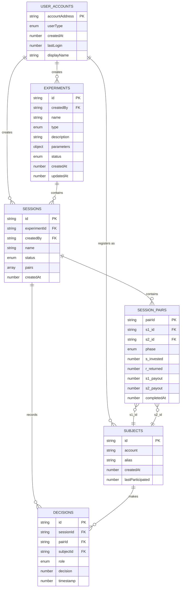
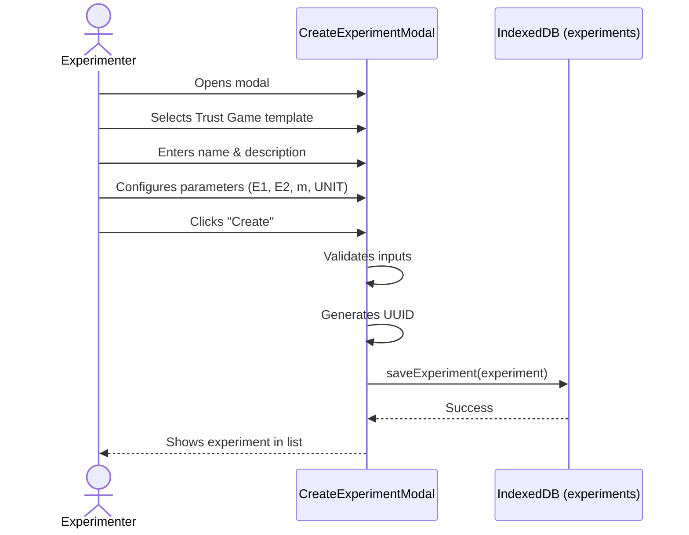
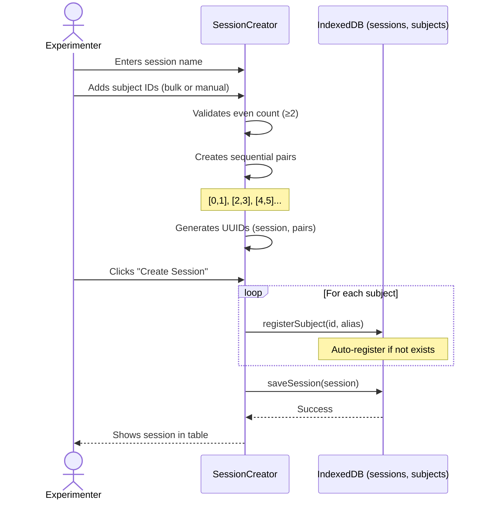
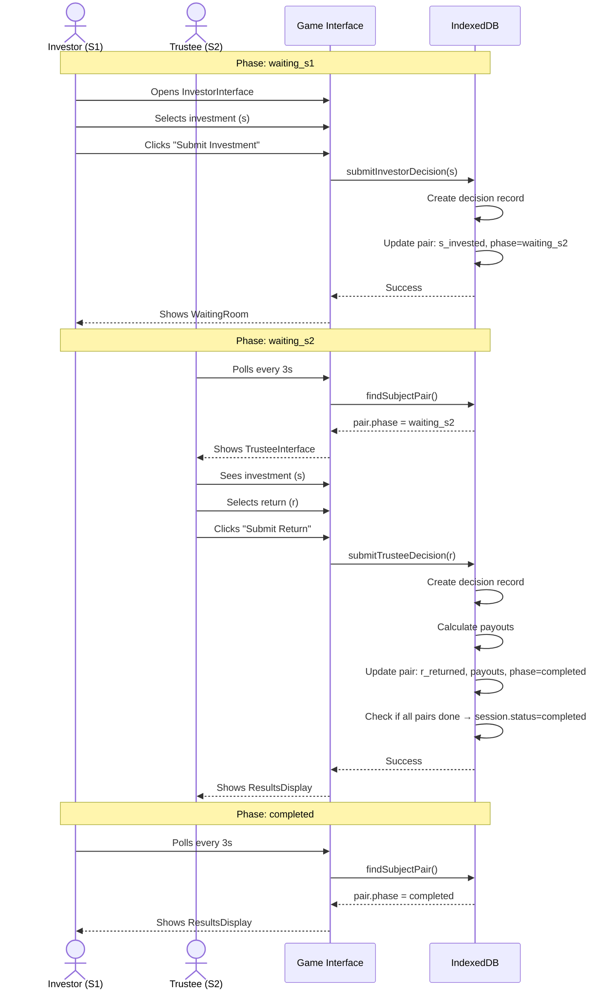
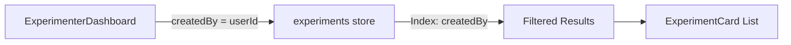
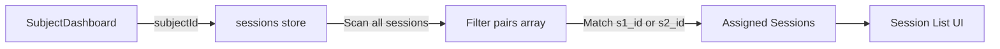
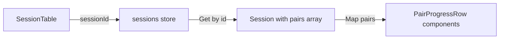
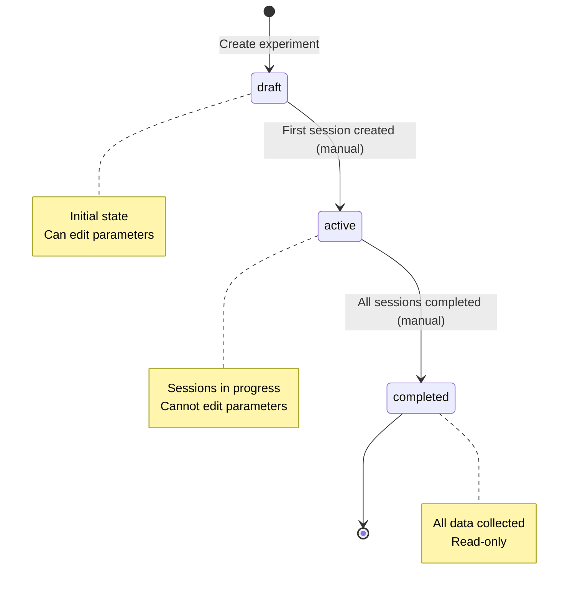
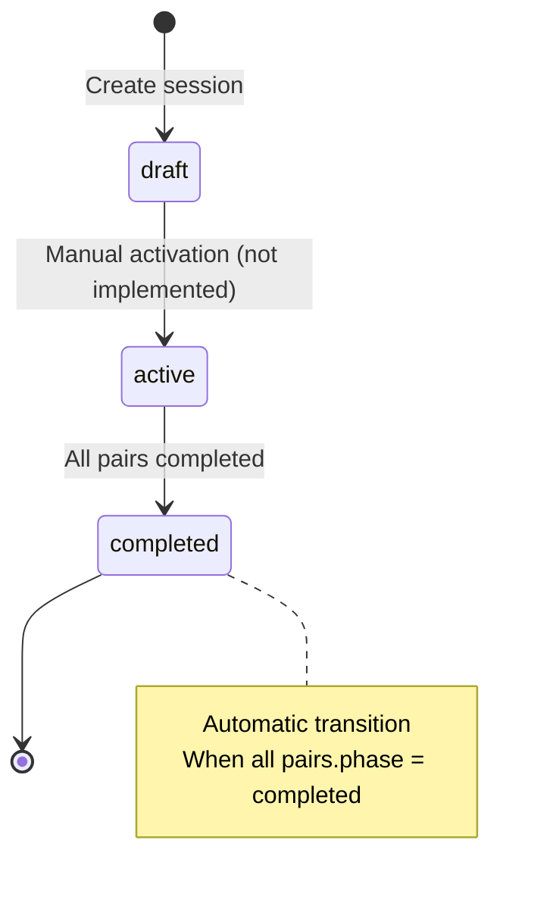
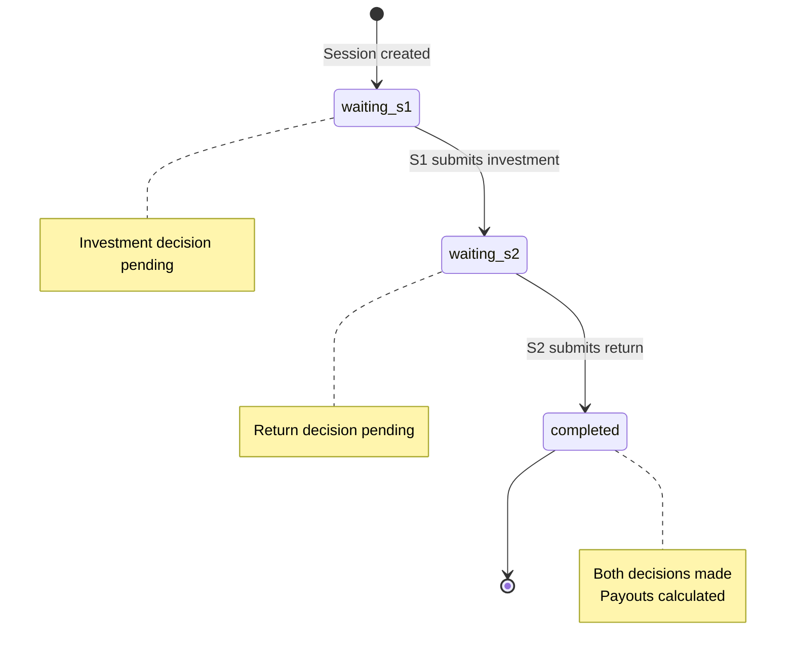

# bTree Platform - Data Architecture

**Version:** 1.0
**Date:** 2025-11-10
**Scope:** Frontend Application

---

## 1. Overview

The bTree platform uses **IndexedDB** for client-side data persistence. The architecture consists of two separate databases with distinct purposes:

1. **`btree_accounts`** - User account management
2. **`btree_experiments`** - Experimental data (experiments, sessions, decisions, subjects)

---

## 2. Database Architecture Diagram

```mermaid
graph TB
    subgraph Browser Storage
        subgraph DB1[btree_accounts Database]
            UA[user_accounts Store]
        end

        subgraph DB2[btree_experiments Database]
            EXP[experiments Store]
            SESS[sessions Store]
            DEC[decisions Store]
            SUB[subjects Store]
        end

        SS[sessionStorage<br/>Active Account]
    end

    UA -->|accountAddress| SS
    EXP -->|createdBy| UA
    SESS -->|experimentId| EXP
    SESS -->|createdBy| UA
    SESS -->|pairs[].s1_id| SUB
    SESS -->|pairs[].s2_id| SUB
    DEC -->|sessionId| SESS
    DEC -->|subjectId| SUB

    style DB1 fill:#e1f5ff
    style DB2 fill:#fff4e1
    style SS fill:#f0f0f0
```

---

## 3. Database Schemas

### 3.1 Database: `btree_accounts`

**Purpose:** Store user account information for authentication and role-based access.

**Version:** 1

#### Store: `user_accounts`

| Field | Type | Key | Required | Description |
|-------|------|-----|----------|-------------|
| accountAddress | string | PRIMARY | ✓ | UUID, unique identifier |
| userType | enum | - | ✓ | 'subject' \| 'experimenter' \| 'admin' |
| createdAt | number | - | ✓ | Unix timestamp (ms) |
| lastLogin | number | - | ✓ | Unix timestamp (ms) |
| displayName | string | - | - | Optional alias/name |

**Indexes:** None

**Example Record:**
```json
{
  "accountAddress": "550e8400-e29b-41d4-a716-446655440000",
  "userType": "experimenter",
  "createdAt": 1699564800000,
  "lastLogin": 1699651200000,
  "displayName": "Dr. Sarah Chen"
}
```

---

### 3.2 Database: `btree_experiments`

**Purpose:** Store all experimental data including experiments, sessions, decisions, and subjects.

**Version:** 1

#### Store: `experiments`

| Field | Type | Key | Indexed | Required | Description |
|-------|------|-----|---------|----------|-------------|
| id | string | PRIMARY | - | ✓ | UUID |
| createdBy | string | - | ✓ | ✓ | Experimenter accountAddress |
| createdAt | number | - | - | ✓ | Unix timestamp (ms) |
| updatedAt | number | - | - | ✓ | Unix timestamp (ms) |
| name | string | - | - | ✓ | Experiment name |
| type | enum | - | ✓ | ✓ | 'trust_game' \| 'dictator_game' |
| description | string | - | - | - | Optional description |
| parameters | object | - | - | ✓ | Game parameters (see below) |
| status | enum | - | ✓ | ✓ | 'draft' \| 'active' \| 'completed' |

**Parameters Object (Trust Game):**
| Field | Type | Required | Description |
|-------|------|----------|-------------|
| E1 | number | ✓ | S1 endowment (µALGO) |
| E2 | number | ✓ | S2 endowment (µALGO) |
| m | number | ✓ | Multiplier |
| UNIT | number | ✓ | Step size (µALGO) |

**Indexes:**
- `createdBy` (experimenter filtering)
- `type` (experiment type filtering)
- `status` (status filtering)

**Example Record:**
```json
{
  "id": "7c9e6679-7425-40de-944b-e07fc1f90ae7",
  "createdBy": "550e8400-e29b-41d4-a716-446655440000",
  "createdAt": 1699564800000,
  "updatedAt": 1699564800000,
  "name": "Trust Game Study 2024",
  "type": "trust_game",
  "description": "Investigating reciprocity under high stakes",
  "parameters": {
    "E1": 1000000,
    "E2": 1000000,
    "m": 3,
    "UNIT": 100000
  },
  "status": "active"
}
```

---

#### Store: `sessions`

| Field | Type | Key | Indexed | Required | Description |
|-------|------|-----|---------|----------|-------------|
| id | string | PRIMARY | - | ✓ | UUID |
| experimentId | string | - | ✓ | ✓ | FK to experiments.id |
| createdBy | string | - | ✓ | ✓ | Experimenter accountAddress |
| createdAt | number | - | - | ✓ | Unix timestamp (ms) |
| name | string | - | - | ✓ | Session name |
| status | enum | - | ✓ | ✓ | 'draft' \| 'active' \| 'completed' |
| pairs | array | - | - | ✓ | Array of SessionPair objects |

**SessionPair Object:**
| Field | Type | Required | Description |
|-------|------|----------|-------------|
| pairId | string | ✓ | UUID |
| s1_id | string | ✓ | Investor subject ID |
| s2_id | string | ✓ | Trustee subject ID |
| phase | enum | ✓ | 'waiting_s1' \| 'waiting_s2' \| 'completed' |
| s_invested | number \| null | ✓ | Investment amount (µALGO) |
| r_returned | number \| null | ✓ | Return amount (µALGO) |
| s1_payout | number \| null | ✓ | S1 final payout (µALGO) |
| s2_payout | number \| null | ✓ | S2 final payout (µALGO) |
| completedAt | number \| null | ✓ | Unix timestamp (ms) |

**Indexes:**
- `experimentId` (session lookup by experiment)
- `createdBy` (session lookup by experimenter)
- `status` (status filtering)

**Example Record:**
```json
{
  "id": "a1b2c3d4-e5f6-7890-abcd-ef1234567890",
  "experimentId": "7c9e6679-7425-40de-944b-e07fc1f90ae7",
  "createdBy": "550e8400-e29b-41d4-a716-446655440000",
  "createdAt": 1699651200000,
  "name": "Session 1 - Morning Group",
  "status": "active",
  "pairs": [
    {
      "pairId": "f1e2d3c4-b5a6-7890-1234-567890abcdef",
      "s1_id": "subject-uuid-001",
      "s2_id": "subject-uuid-002",
      "phase": "waiting_s2",
      "s_invested": 500000,
      "r_returned": null,
      "s1_payout": null,
      "s2_payout": null,
      "completedAt": null
    },
    {
      "pairId": "a9b8c7d6-e5f4-3210-9876-543210fedcba",
      "s1_id": "subject-uuid-003",
      "s2_id": "subject-uuid-004",
      "phase": "completed",
      "s_invested": 700000,
      "r_returned": 1200000,
      "s1_payout": 1500000,
      "s2_payout": 1800000,
      "completedAt": 1699651500000
    }
  ]
}
```

---

#### Store: `decisions`

| Field | Type | Key | Indexed | Required | Description |
|-------|------|-----|---------|----------|-------------|
| id | string | PRIMARY | - | ✓ | UUID |
| sessionId | string | - | ✓ | ✓ | FK to sessions.id |
| pairId | string | - | ✓ | ✓ | FK to sessions.pairs[].pairId |
| subjectId | string | - | ✓ | ✓ | FK to subjects.id |
| role | enum | - | - | ✓ | 's1' \| 's2' |
| decision | number | - | - | ✓ | Amount (µALGO) |
| timestamp | number | - | - | ✓ | Unix timestamp (ms) |

**Indexes:**
- `sessionId` (decisions by session)
- `pairId` (decisions by pair)
- `subjectId` (decisions by subject)

**Example Record:**
```json
{
  "id": "dec12345-6789-abcd-ef01-234567890abc",
  "sessionId": "a1b2c3d4-e5f6-7890-abcd-ef1234567890",
  "pairId": "f1e2d3c4-b5a6-7890-1234-567890abcdef",
  "subjectId": "subject-uuid-001",
  "role": "s1",
  "decision": 500000,
  "timestamp": 1699651230000
}
```

---

#### Store: `subjects`

| Field | Type | Key | Indexed | Required | Description |
|-------|------|-----|---------|----------|-------------|
| id | string | PRIMARY | - | ✓ | Account address (UUID) |
| account | string | - | - | ✓ | Same as id |
| alias | string | - | ✓ | ✓ | Display name |
| createdAt | number | - | ✓ | ✓ | Unix timestamp (ms) |
| lastParticipated | number | - | ✓ | - | Last session timestamp |

**Indexes:**
- `alias` (search by name)
- `createdAt` (sort by creation date)
- `lastParticipated` (sort by activity)

**Example Record:**
```json
{
  "id": "subject-uuid-001",
  "account": "subject-uuid-001",
  "alias": "Alex Martinez",
  "createdAt": 1699564800000,
  "lastParticipated": 1699651230000
}
```

---

## 4. Entity Relationship Diagram



---

## 5. Data Flow Diagrams

### 5.1 Experiment Creation Flow



---

### 5.2 Session Creation Flow



---

### 5.3 Subject Gameplay Flow



---

### 5.4 Data Query Patterns

#### Pattern 1: Experimenter Views Experiments


#### Pattern 2: Subject Views Assigned Sessions


#### Pattern 3: Monitor Pair Progress


---

## 6. State Transitions

### 6.1 Experiment Status State Machine



---

### 6.2 Session Status State Machine



---

### 6.3 Pair Phase State Machine



---

## 7. Data Access Patterns

### 7.1 Read Operations

| Operation | Store | Query Type | Index Used | Estimated Time |
|-----------|-------|------------|------------|----------------|
| Get user account | user_accounts | Get by key | Primary key | < 10ms |
| List my experiments | experiments | Get all + filter | createdBy | < 50ms |
| Get experiment details | experiments | Get by key | Primary key | < 10ms |
| List experiment sessions | sessions | Get all + filter | experimentId | < 50ms |
| Get session details | sessions | Get by key | Primary key | < 10ms |
| Find subject's pair | sessions | Get by key + scan | Primary key | < 30ms |
| List subject sessions | sessions | Get all + scan | None | < 100ms |
| Get pair decisions | decisions | Get all + filter | pairId | < 50ms |

---

### 7.2 Write Operations

| Operation | Store | Type | Cascading Updates | Estimated Time |
|-----------|-------|------|-------------------|----------------|
| Create account | user_accounts | Insert | None | < 20ms |
| Create experiment | experiments | Insert | None | < 20ms |
| Create session | sessions, subjects | Insert | Register subjects | < 50ms |
| Submit S1 decision | decisions, sessions | Insert + Update | Update pair in session | < 100ms |
| Submit S2 decision | decisions, sessions | Insert + Update | Update pair + check session | < 150ms |

---

## 8. Data Validation Rules

### 8.1 Experiment Parameters

| Field | Validation | Error Message |
|-------|------------|---------------|
| E1 | > 0, integer | "E1 must be a positive integer" |
| E2 | > 0, integer | "E2 must be a positive integer" |
| m | > 0, integer | "Multiplier must be a positive integer" |
| UNIT | > 0, integer, ≤ E1, ≤ E2 | "UNIT must be positive and not exceed endowments" |

---

### 8.2 Session Creation

| Rule | Validation | Error Message |
|------|------------|---------------|
| Subject count | even, ≥ 2 | "Must have even number of subjects (minimum 2)" |
| Unique subjects | No duplicates | "Cannot assign same subject multiple times" |
| Valid UUIDs | Regex match UUID | "Invalid subject ID format" |

---

### 8.3 Decision Submission

| Field | Validation | Error Message |
|-------|------------|---------------|
| Investment (s) | 0 ≤ s ≤ E1, s % UNIT = 0 | "Investment must be between 0 and E1 in UNIT increments" |
| Return (r) | 0 ≤ r ≤ (s × m), r % UNIT = 0 | "Return must be between 0 and received amount in UNIT increments" |
| Phase | Must match expected phase | "Cannot submit decision at this time" |

---

## 9. Data Consistency Rules

### 9.1 Referential Integrity

| Relationship | Rule | Enforcement |
|--------------|------|-------------|
| experiments.createdBy → user_accounts.accountAddress | Must exist | Client-side check |
| sessions.experimentId → experiments.id | Must exist | Client-side check |
| sessions.createdBy → user_accounts.accountAddress | Must exist | Client-side check |
| sessions.pairs[].s1_id → subjects.id | Auto-create if missing | Auto-registration |
| sessions.pairs[].s2_id → subjects.id | Auto-create if missing | Auto-registration |
| decisions.sessionId → sessions.id | Must exist | Client-side check |
| decisions.subjectId → subjects.id | Must exist | Client-side check |

---

### 9.2 Data Synchronization

| Event | Trigger | Update |
|-------|---------|--------|
| S1 submits decision | submitInvestorDecision() | decisions store + sessions.pairs[] |
| S2 submits decision | submitTrusteeDecision() | decisions store + sessions.pairs[] + session.status |
| All pairs complete | Last S2 decision | session.status → 'completed' |

---

## 10. Storage Estimates

### 10.1 Record Sizes (Approximate)

| Store | Avg Record Size | Notes |
|-------|-----------------|-------|
| user_accounts | 150 bytes | Small, minimal data |
| experiments | 300 bytes | Includes parameters object |
| sessions | 500 bytes + (150 × pairs) | Grows with pair count |
| decisions | 200 bytes | Simple decision record |
| subjects | 150 bytes | Minimal subject info |

---

### 10.2 Capacity Estimates

**Scenario: 10 Experimenters, 100 Subjects, 50 Experiments, 200 Sessions**

| Store | Record Count | Total Size | Notes |
|-------|--------------|------------|-------|
| user_accounts | 110 | 16.5 KB | 10 experimenters + 100 subjects |
| experiments | 50 | 15 KB | |
| sessions | 200 | 700 KB | Avg 20 pairs/session = 4,000 pairs |
| decisions | 8,000 | 1.6 MB | 2 decisions per pair |
| subjects | 100 | 15 KB | Auto-registered |
| **TOTAL** | | **~2.35 MB** | Well within browser limits |

**Browser IndexedDB Quota:** Typically 50% of available disk space, minimum ~10 MB

---

## 11. Backup and Recovery

### 11.1 Export Functions (Future)

```typescript
// Export experiments to JSON
exportExperiments(): Promise<Blob>

// Export session data to CSV
exportSessionData(sessionId: string): Promise<Blob>

// Backup entire database
backupDatabase(dbName: string): Promise<Blob>

// Import from backup
restoreDatabase(dbName: string, data: Blob): Promise<void>
```

---

### 11.2 Data Portability

**Current Status:** No export functionality

**Planned Features:**
- JSON export for experiments
- CSV export for session data
- Full database backup/restore
- Selective data export by date range

---

## 12. Performance Optimization

### 12.1 Indexing Strategy

**Indexed Fields:**
- `experiments.createdBy` - High selectivity, frequent queries
- `experiments.type` - Low selectivity, useful for filtering
- `experiments.status` - Low selectivity, useful for filtering
- `sessions.experimentId` - High selectivity, critical for relationship
- `sessions.createdBy` - High selectivity, frequent queries
- `sessions.status` - Low selectivity, useful for filtering
- `decisions.sessionId` - High selectivity, critical for analysis
- `decisions.pairId` - High selectivity, critical for pair lookup
- `decisions.subjectId` - High selectivity, useful for subject history
- `subjects.createdAt` - Range queries for recent subjects
- `subjects.lastParticipated` - Range queries for active subjects

---

### 12.2 Query Optimization Tips

**Do:**
- ✅ Use indexes for filtering (createdBy, experimentId)
- ✅ Query by primary key when possible
- ✅ Limit result sets with cursor ranges
- ✅ Cache frequently accessed data in component state

**Avoid:**
- ❌ Full table scans (e.g., finding subject sessions requires scan)
- ❌ Complex filtering on non-indexed fields
- ❌ Frequent writes during reads (use batching)
- ❌ Large embedded arrays (pairs array can grow)

---

## 13. Migration Considerations (Future)

### 13.1 Schema Evolution

**Current Version:** 1 (both databases)

**Potential Migrations:**
- Add `experiment.tags` for categorization
- Add `session.scheduledStart` for scheduling
- Add `subjects.email` for notifications
- Normalize `sessions.pairs` into separate store for scalability
- Add `treatments` table for treatment variations

---

### 13.2 Backend Migration Path

**When moving to backend:**

1. **Phase 1:** Add sync layer
   - Keep IndexedDB as local cache
   - POST/PUT to backend API
   - Conflict resolution strategy

2. **Phase 2:** Backend becomes source of truth
   - IndexedDB becomes read-through cache
   - WebSocket for real-time updates
   - Offline support with sync queue

3. **Phase 3:** Migrate to backend-only
   - IndexedDB only for offline mode
   - Full server-side validation
   - Multi-experimenter collaboration

---

## Appendix: Related Documents

- **Functional Specifications:** [functional-specifications.md](functional-specifications.md)
- **Product Document:** [product-document.md](product-document.md)
- **Database Operations API:** [frontend/src/utils/db.ts](frontend/src/utils/db.ts)
- **Type Definitions:** [frontend/src/types/experiment.ts](frontend/src/types/experiment.ts)

---

**END OF DOCUMENT**