# BX-HIVE Smart Contract Architecture

**Version:** 1.0
**Date:** 2025-01-21
**Status:** Draft
**Scope:** Algorand Smart Contracts (Algorand Python / PuyaPy)

---

## 1. Overview

This document describes the smart contract architecture for migrating the bx-hive behavioral economics experiment platform to the Algorand blockchain.

### 1.1 Goals

- Store experiment data on-chain for transparency and auditability
- Enable real ALGO/USDCa payouts to experiment subjects
- Provide financial isolation between experimenters
- Support multiple game types (Trust Game, BRET, etc.)
- Enable future features: risk profiling, privacy/anonymization

### 1.2 Key Decisions

| Decision | Choice | Rationale |
|----------|--------|-----------|
| Architecture | 3-Layer (Registry → Factory → Experiment) | Financial isolation between experimenters |
| Language | Algorand Python (PuyaPy) | User preference, Python ecosystem |
| Payouts | Real ALGO/USDCa transfers | Actual incentives for subjects |
| Escrow | Per-experiment contract | Isolation, clear ownership |
| MVP Scope | Trust Game only | Focus, add BRET later |

---

## 2. Architecture Overview

The system uses a 3-layer architecture where each experiment is its own isolated contract.

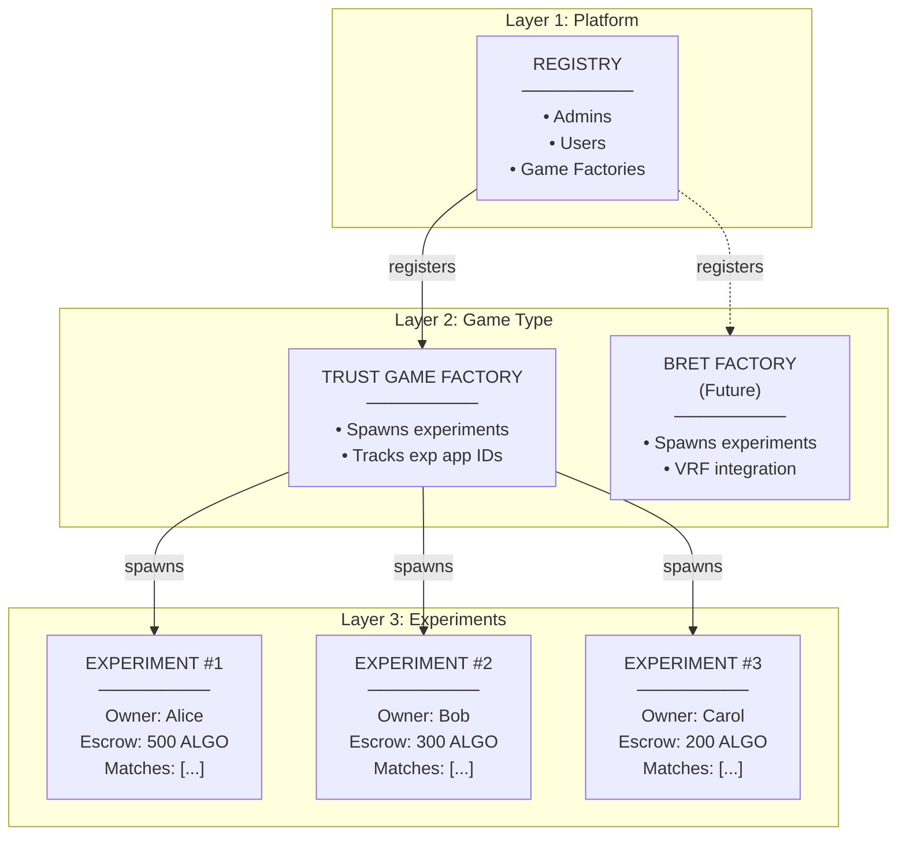

### 2.1 Why 3 Layers?

**Financial Isolation**: Each experimenter deposits their own money into their own contract. A bug or exploit in one experiment cannot affect another experimenter's funds.

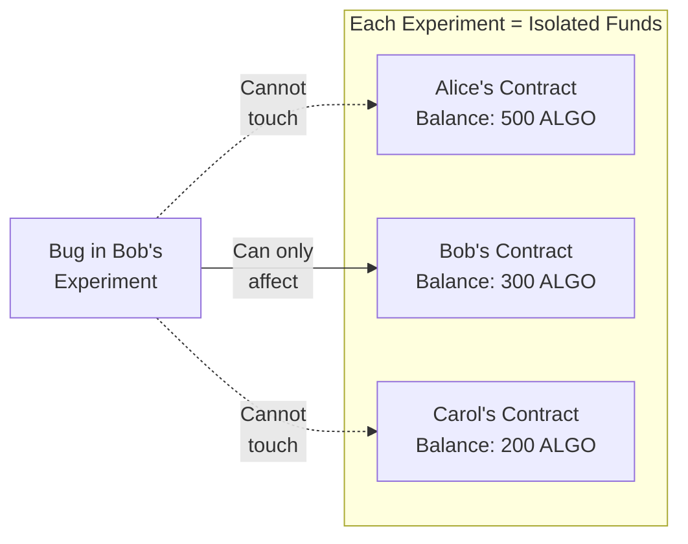

---

## 3. Contract Specifications

### 3.1 Registry Contract

**Purpose**: Platform-wide coordination - the "phone book" of users and game factories.

**Holds Money**: No

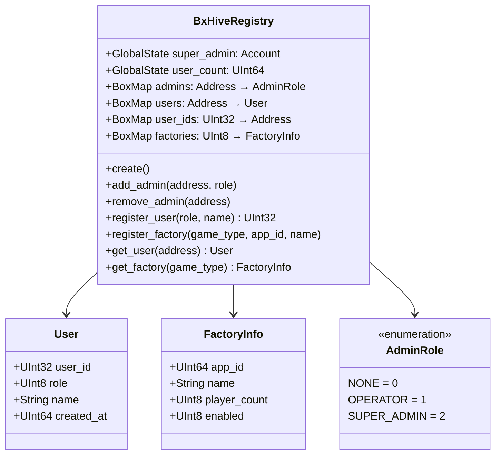

#### Methods

| Method | Access | Description |
|--------|--------|-------------|
| `create()` | Deployer | Initialize registry, set deployer as super_admin |
| `add_admin(addr, role)` | Super Admin | Add new admin with role |
| `remove_admin(addr)` | Super Admin | Remove admin |
| `register_user(role, name)` | Public | Register new user, returns user_id |
| `register_factory(type, app_id, name)` | Super Admin | Register a game factory |
| `get_user(addr)` | Public | Query user by address |
| `get_factory(type)` | Public | Query factory by game type |

---

### 3.2 Trust Game Factory Contract

**Purpose**: Spawns and tracks Trust Game experiment contracts.

**Holds Money**: No

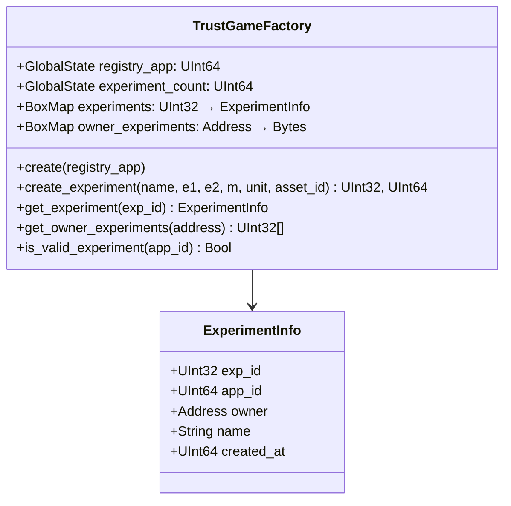

#### Methods

| Method | Access | Description |
|--------|--------|-------------|
| `create(registry_app)` | Deployer | Initialize factory with registry reference |
| `create_experiment(...)` | Experimenter | Deploy new experiment contract, returns (exp_id, app_id) |
| `get_experiment(exp_id)` | Public | Get experiment info by ID |
| `get_owner_experiments(addr)` | Public | List all experiments owned by address |
| `is_valid_experiment(app_id)` | Public | Verify contract was spawned by this factory |

---

### 3.3 Trust Game Experiment Contract

**Purpose**: Single experiment - configuration, subjects, matches, escrow, and payouts.

**Holds Money**: Yes (experimenter's escrow)

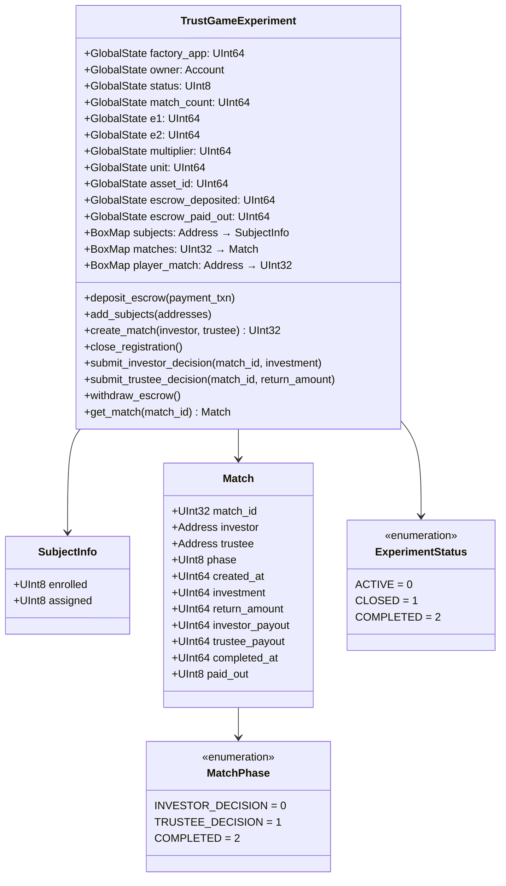

#### Methods

| Method | Access | Description |
|--------|--------|-------------|
| **Setup (Owner)** | | |
| `deposit_escrow(payment_txn)` | Owner | Fund the experiment escrow |
| `add_subjects([addresses])` | Owner | Enroll subjects in experiment |
| `create_match(investor, trustee)` | Owner | Pair two subjects into a match |
| `close_registration()` | Owner | Prevent new subjects |
| `withdraw_escrow()` | Owner | Reclaim unused escrow (when completed) |
| **Gameplay (Subjects)** | | |
| `submit_investor_decision(match_id, investment)` | Investor | Submit investment amount |
| `submit_trustee_decision(match_id, return_amount)` | Trustee | Submit return, triggers payout |
| **Queries (Public)** | | |
| `get_config()` | Public | Get game parameters |
| `get_match(match_id)` | Public | Get match state |
| `get_player_match(address)` | Public | Get player's active match |
| `get_escrow_balance()` | Public | Check remaining escrow |

---

## 4. Data Model

### 4.1 Entity Relationships

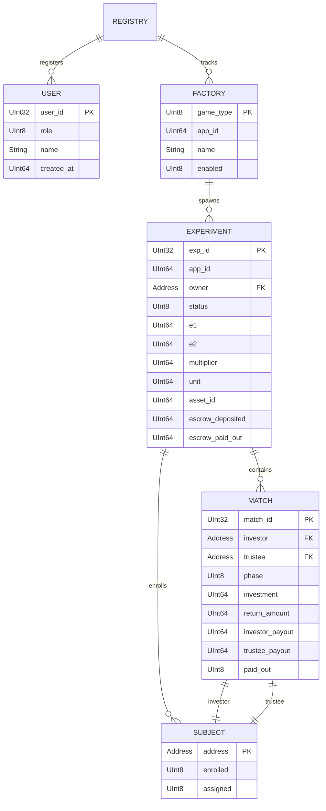

### 4.2 Storage Location Summary

| Data | Contract | Storage Type | Key |
|------|----------|--------------|-----|
| Admins | Registry | BoxMap | `adm_` + address |
| Users | Registry | BoxMap | `u_` + address |
| User ID → Address | Registry | BoxMap | `ui_` + user_id |
| Factories | Registry | BoxMap | `f_` + game_type |
| Experiment Info | Factory | BoxMap | `e_` + exp_id |
| Owner's Experiments | Factory | BoxMap | `oe_` + address |
| Subjects | Experiment | BoxMap | `s_` + address |
| Matches | Experiment | BoxMap | `m_` + match_id |
| Player Active Match | Experiment | BoxMap | `pm_` + address |

---

## 5. Workflows

### 5.1 Experiment Creation

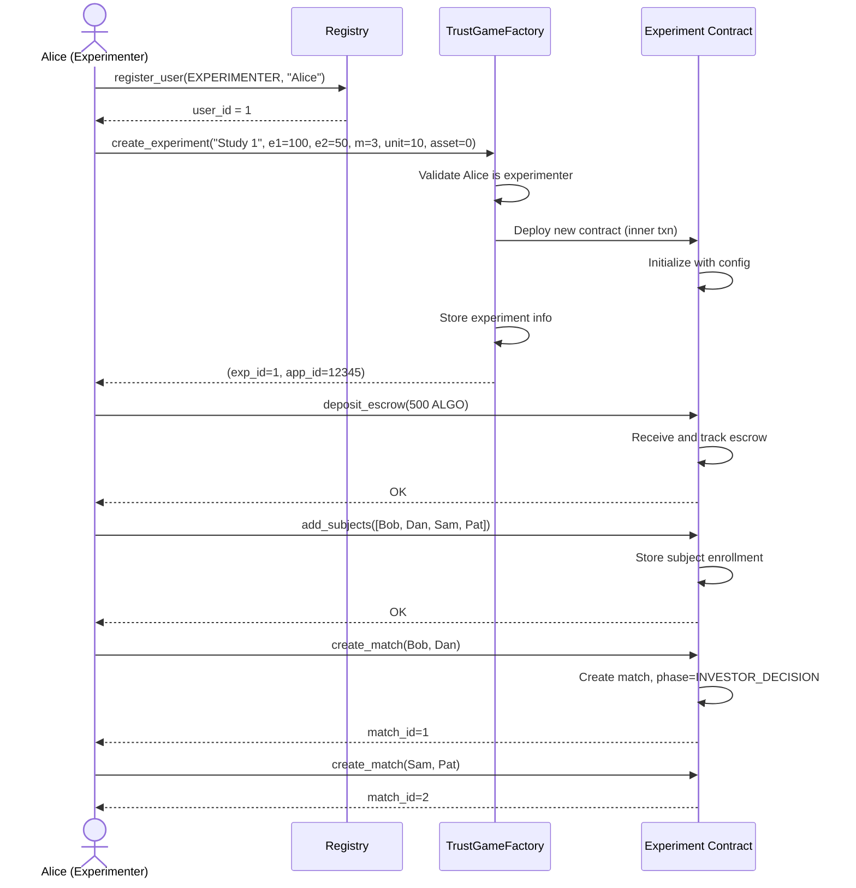

### 5.2 Trust Game Play

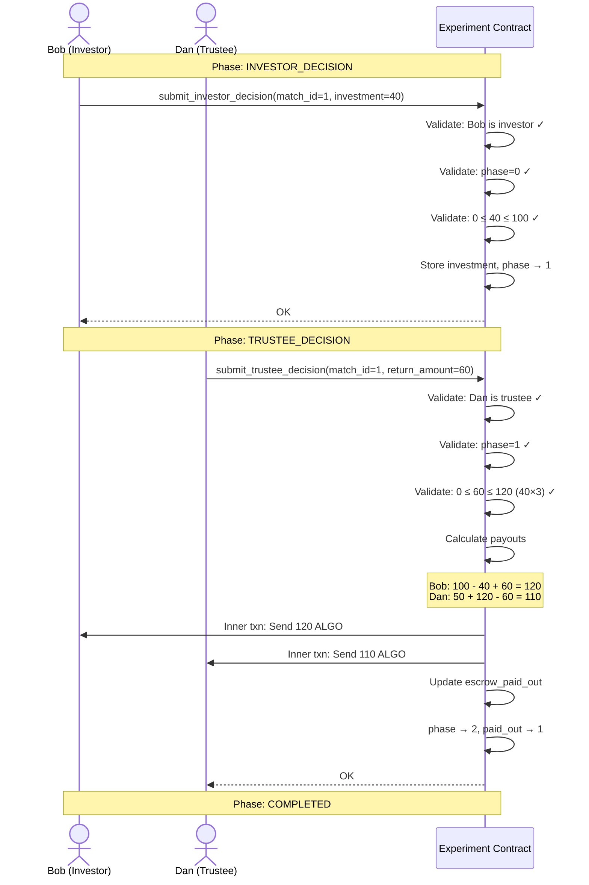

### 5.3 Experiment Cleanup

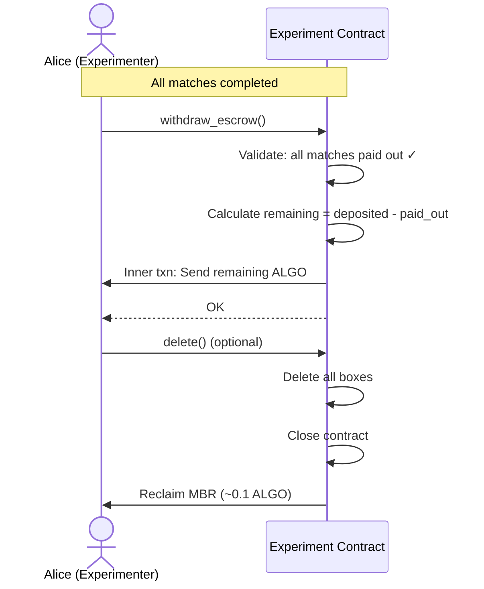

---

## 6. Trust Game Logic

### 6.1 Parameters

| Parameter | Description | Example |
|-----------|-------------|---------|
| `e1` | Investor endowment (microAlgo or ASA base units) | 1,000,000 (1 ALGO) |
| `e2` | Trustee endowment | 500,000 (0.5 ALGO) |
| `multiplier` | Investment multiplier (m) | 3 |
| `unit` | Step size for decisions | 100,000 (0.1 ALGO) |
| `asset_id` | 0 = ALGO, >0 = ASA (e.g., USDCa) | 0 |

### 6.2 Game Flow

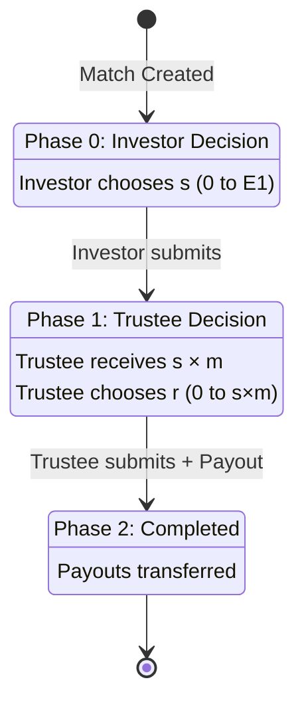

### 6.3 Payout Calculation

```
Given:
  E1 = Investor endowment
  E2 = Trustee endowment
  m  = Multiplier
  s  = Investment amount (chosen by Investor)
  r  = Return amount (chosen by Trustee)

Payouts:
  Investor Payout = E1 - s + r
  Trustee Payout  = E2 + (s × m) - r
```

**Example:**
- E1 = 100, E2 = 50, m = 3
- Investor invests s = 40
- Trustee receives 40 × 3 = 120
- Trustee returns r = 60

**Result:**
- Investor: 100 - 40 + 60 = **120**
- Trustee: 50 + 120 - 60 = **110**

---

## 7. File Structure

```
projects/bx-hive-contracts/smart_contracts/
│
├── registry/
│   ├── __init__.py
│   ├── contract.py              # BxHiveRegistry
│   └── deploy_config.py
│
├── trust_game_factory/
│   ├── __init__.py
│   ├── contract.py              # TrustGameFactory
│   └── deploy_config.py
│
├── trust_game_experiment/
│   ├── __init__.py
│   ├── contract.py              # TrustGameExperiment (template)
│   └── deploy_config.py
│
├── shared/
│   ├── __init__.py
│   └── types.py                 # Shared ARC4 structs
│
└── __main__.py                  # Build entry point


projects/bx-hive-contracts/tests/
│
├── conftest.py                  # Shared fixtures, LocalNet setup
├── test_registry.py             # Registry unit tests
├── test_trust_game_factory.py   # Factory unit tests
├── test_trust_game_experiment.py # Experiment unit tests
└── test_integration.py          # End-to-end tests
```

---

## 8. Cost Estimates

### 8.1 Minimum Balance Requirements

| Item | MBR Cost |
|------|----------|
| Registry contract | ~0.1 ALGO |
| Factory contract | ~0.1 ALGO |
| Each Experiment contract | ~0.1 ALGO |
| Box storage | ~0.0025 ALGO + 0.0004 ALGO/byte |

### 8.2 Per-Experiment Costs

| Item | Size | Cost |
|------|------|------|
| Experiment contract MBR | - | ~0.1 ALGO |
| Subject enrollment (per subject) | ~50 bytes | ~0.045 ALGO |
| Match record (per match) | ~150 bytes | ~0.085 ALGO |

**Example: 20 subjects, 10 matches**
- Contract MBR: 0.1 ALGO
- Subjects: 20 × 0.045 = 0.9 ALGO
- Matches: 10 × 0.085 = 0.85 ALGO
- **Total: ~1.85 ALGO** (plus escrow for payouts)

---

## 9. Security Considerations

### 9.1 Access Control

| Action | Who Can Do It |
|--------|---------------|
| Add/remove admins | Super Admin only |
| Register game factory | Super Admin only |
| Create experiment | Registered experimenters |
| Deposit escrow | Experiment owner only |
| Add subjects | Experiment owner only |
| Create matches | Experiment owner only |
| Submit decisions | Assigned player only |
| Withdraw escrow | Experiment owner (when complete) |

### 9.2 Validation Rules

**Investment Decision:**
- Caller must be the assigned investor
- Match must be in phase 0 (INVESTOR_DECISION)
- Investment must be: `0 ≤ s ≤ E1`
- Investment must be multiple of `unit`

**Trustee Decision:**
- Caller must be the assigned trustee
- Match must be in phase 1 (TRUSTEE_DECISION)
- Return must be: `0 ≤ r ≤ (s × m)`
- Return must be multiple of `unit`

### 9.3 Escrow Safety

- Escrow held in isolated experiment contract
- Payouts via inner transactions (atomic)
- Experimenter can only withdraw after all matches paid
- Contract deletion requires all boxes cleared

---

## 10. Future Enhancements

### 10.1 BRET Game (Post-MVP)

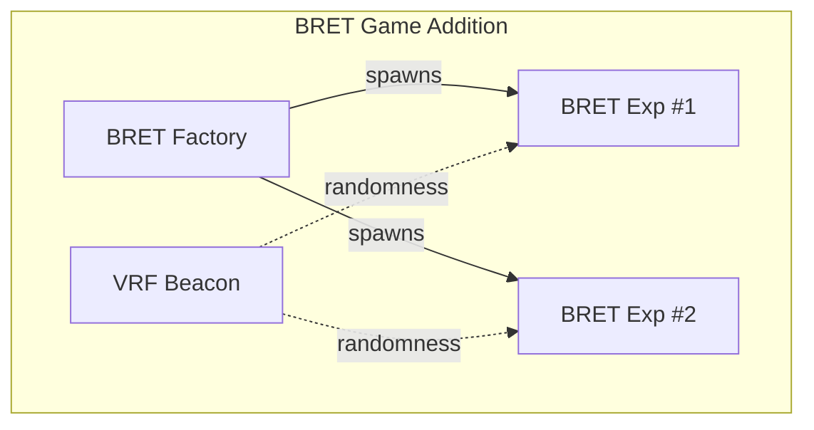

- Single-player game
- VRF integration for provably random bomb placement
- Similar factory pattern to Trust Game

### 10.2 Risk Profile Contract (Post-MVP)

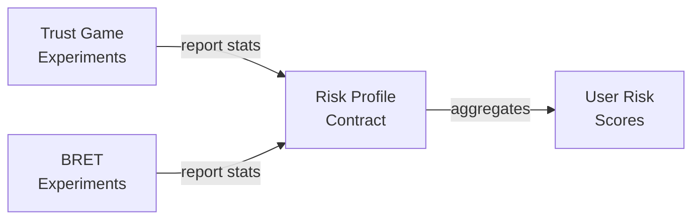

- Separate contract for aggregating user behavior
- Called by experiment contracts after match completion
- Computes risk aversion scores across game types

### 10.3 Privacy Features (Post-MVP)

- Pseudonymous experiment IDs (address → anon_id mapping)
- Only experimenter can link identity
- On-chain data uses anonymous identifiers

---

## 11. Implementation Phases

### Phase 1: Core Contracts (MVP)

1. `shared/types.py` - ARC4 struct definitions
2. `registry/contract.py` - User and factory management
3. `trust_game_experiment/contract.py` - Experiment template
4. `trust_game_factory/contract.py` - Factory spawner
5. Unit tests for all contracts
6. Integration tests
7. LocalNet deployment and testing

### Phase 2: Frontend Integration

1. Generate TypeScript clients from ARC-56 specs
2. Add wallet connection (use-wallet)
3. Create blockchain interaction hooks
4. Update frontend to call contracts
5. Transaction signing UI

### Phase 3: Testnet Deployment

1. Deploy contracts to Algorand Testnet
2. Configure frontend for testnet
3. End-to-end testing with test accounts
4. Bug fixes and optimizations

### Phase 4: Future Features

1. BRET Factory + Experiment contracts
2. Risk Profile contract
3. Privacy/anonymization features
4. Mainnet deployment

---

## Appendix A: Glossary

| Term | Definition |
|------|------------|
| **Experimenter** | User who creates and manages experiments |
| **Subject** | User who participates in experiments |
| **Experiment** | A configured game setup with parameters and escrow |
| **Match** | A single instance of gameplay between subjects |
| **Escrow** | Funds deposited by experimenter for subject payouts |
| **Factory** | Contract that spawns experiment contracts |
| **MBR** | Minimum Balance Requirement (Algorand) |
| **ASA** | Algorand Standard Asset (e.g., USDCa) |

---

## Appendix B: Related Documents

- [Functional Specifications](./functional-specifications.md)
- [Product Document](./product-document.md)
- [Data Architecture](./data-architecture.md)

---

**END OF DOCUMENT**