```mermaid
classDiagram
    class TrustExperiments {
        +GlobalState registry_app: UInt64
        +GlobalState experiment_count: UInt64
        +BoxMap experiments: UInt32 → ExperimentGroup
        +BoxMap variations: Bytes → VariationInfo
        +BoxMap owner_experiments: Address → Bytes
        +create(registry_app)
        +create_experiment(name) UInt32
        +create_variation(exp_id, label, e1, e2, m, unit, asset_id) UInt32, UInt64
        +get_experiment(exp_id) ExperimentGroup
        +get_variation(exp_id, var_id) VariationInfo
        +get_owner_experiments(address) UInt32[]
    }

    class ExperimentGroup {
        +UInt32 exp_id
        +Address owner
        +String name
        +UInt64 created_at
        +UInt64 variation_count
    }

    class VariationInfo {
        +UInt32 var_id
        +UInt64 app_id
        +String label
        +UInt64 created_at
    }

    TrustExperiments --> ExperimentGroup
    TrustExperiments --> VariationInfo
```

# BX-HIVE Smart Contract Architecture

**Version:** 1.0
**Date:** 2025-01-21
**Status:** Draft
**Scope:** Algorand Smart Contracts (Algorand Python / PuyaPy)

---

## 1. Overview

This document describes the smart contract architecture for migrating the bx-hive behavioral economics experiment platform to the Algorand blockchain.

### 1.1 Goals

- Store experiment data on-chain for transparency and auditability
- Enable real ALGO/USDCa payouts to experiment subjects
- Provide financial isolation between experimenters
- Support multiple game types (Trust Game, BRET, etc.)
- Enable future features: risk profiling, privacy/anonymization

### 1.2 Key Decisions

| Decision | Choice | Rationale |
|----------|--------|-----------|
| Architecture | 3-Layer (Registry → Experiments → Variations) | Financial isolation between experimenters |
| Language | Algorand Python (PuyaPy) | User preference, Python ecosystem |
| Payouts | Real ALGO/USDCa transfers | Actual incentives for subjects |
| Escrow | Per-experiment contract | Isolation, clear ownership |
| MVP Scope | Trust Game only | Focus, add BRET later |

---

## 2. Architecture Overview

The system uses a 3-layer architecture where each experiment is its own isolated contract.

```mermaid
flowchart TB
    subgraph Layer1["Layer 1: Platform"]
        Registry["REGISTRY<br/>─────────<br/>• Admins<br/>• Users<br/>• Experiment Templates"]
    end

    subgraph Layer2["Layer 2: Experiments"]
        TrustExperiments["TRUST EXPERIMENTS<br/>─────────<br/>• Experiment groups<br/>• Spawns variations<br/>• Tracks variation app IDs"]
        BRETExperiments["BRET EXPERIMENTS<br/>(Future)<br/>─────────<br/>• Spawns variations<br/>• VRF integration"]
    end

    subgraph Layer3["Layer 3: Experiment Variations"]
        Var1["VARIATION #1<br/>─────────<br/>Owner: Alice<br/>m=2 (Low)<br/>Escrow: 200 ALGO"]
        Var2["VARIATION #2<br/>─────────<br/>Owner: Alice<br/>m=3 (Med)<br/>Escrow: 300 ALGO"]
        Var3["VARIATION #3<br/>─────────<br/>Owner: Alice<br/>m=4 (High)<br/>Escrow: 400 ALGO"]
    end

    Registry -->|registers| TrustExperiments
    Registry -.->|registers| BRETExperiments
    TrustExperiments -->|spawns| Var1
    TrustExperiments -->|spawns| Var2
    TrustExperiments -->|spawns| Var3
```


---

## 3. Contract Specifications

### 3.1 Registry Contract

**Purpose**: Platform-wide coordination - the "phone book" of users and experiment templates.

**Holds Money**: No


#### Methods

| Method | Access | Description |
|--------|--------|-------------|
| `create()` | Deployer | Initialize registry, set deployer as super_admin |
| `add_admin(addr, role)` | Super Admin | Add new admin with role |
| `remove_admin(addr)` | Super Admin | Remove admin |
| `register_user(role, name)` | Public | Register new user, returns user_id |
| `register_template(template_id, app_id, name)` | Super Admin | Register an experiment template |
| `get_user(addr)` | Public | Query user by address |
| `get_template(template_id)` | Public | Query experiment template |

---

### 3.2 Trust Experiments Contract (Layer 2)

**Purpose**: Manages experiment groups and spawns variation contracts.

**Holds Money**: No



#### Methods

| Method | Access | Description |
|--------|--------|-------------|
| `create(registry_app)` | Deployer | Initialize with registry reference |
| `create_experiment(name)` | Experimenter | Create experiment group, returns exp_id |
| `create_variation(exp_id, label, ...)` | Experimenter | Deploy variation contract, returns (var_id, app_id) |
| `get_experiment(exp_id)` | Public | Get experiment group info |
| `get_variation(exp_id, var_id)` | Public | Get variation info |
| `get_owner_experiments(addr)` | Public | List all experiments owned by address |

---

### 3.3 Trust Variation Contract (Layer 3)

**Purpose**: Single variation - configuration, subjects, matches, escrow, and payouts.

**Holds Money**: Yes (experimenter's escrow)

```mermaid
classDiagram
    class TrustVariation {
        +GlobalState experiments_app: UInt64
        +GlobalState exp_id: UInt32
        +GlobalState var_id: UInt32
        +GlobalState owner: Account
        +GlobalState status: UInt8
        +GlobalState match_count: UInt64
        +GlobalState e1: UInt64
        +GlobalState e2: UInt64
        +GlobalState multiplier: UInt64
        +GlobalState unit: UInt64
        +GlobalState asset_id: UInt64
        +GlobalState escrow_deposited: UInt64
        +GlobalState escrow_paid_out: UInt64
        +BoxMap subjects: Address → SubjectInfo
        +BoxMap matches: UInt32 → Match
        +BoxMap player_match: Address → UInt32
        +deposit_escrow(payment_txn)
        +add_subjects(addresses)
        +create_match(investor, trustee) UInt32
        +close_registration()
        +submit_investor_decision(match_id, investment)
        +submit_trustee_decision(match_id, return_amount)
        +withdraw_escrow()
        +get_match(match_id) Match
    }

    class SubjectInfo {
        +UInt8 enrolled
        +UInt8 assigned
    }

    class Match {
        +UInt32 match_id
        +Address investor
        +Address trustee
        +UInt8 phase
        +UInt64 created_at
        +UInt64 investment
        +UInt64 return_amount
        +UInt64 investor_payout
        +UInt64 trustee_payout
        +UInt64 completed_at
        +UInt8 paid_out
    }

    class VariationStatus {
        <<enumeration>>
        ACTIVE = 0
        CLOSED = 1
        COMPLETED = 2
    }

    class MatchPhase {
        <<enumeration>>
        INVESTOR_DECISION = 0
        TRUSTEE_DECISION = 1
        COMPLETED = 2
    }

    TrustVariation --> SubjectInfo
    TrustVariation --> Match
    TrustVariation --> VariationStatus
    Match --> MatchPhase
```



#### Methods

| Method | Access | Description |
|--------|--------|-------------|
| **Setup (Owner)** | | |
| `deposit_escrow(payment_txn)` | Owner | Fund the variation escrow |
| `add_subjects([addresses])` | Owner | Enroll subjects in variation |
| `create_match(investor, trustee)` | Owner | Pair two subjects into a match |
| `close_registration()` | Owner | Prevent new subjects |
| `withdraw_escrow()` | Owner | Reclaim unused escrow (when completed) |
| **Participation (Subjects)** | | |
| `submit_investor_decision(match_id, investment)` | Investor | Submit investment amount |
| `submit_trustee_decision(match_id, return_amount)` | Trustee | Submit return, triggers payout |
| **Queries (Public)** | | |
| `get_config()` | Public | Get game parameters |
| `get_match(match_id)` | Public | Get match state |
| `get_player_match(address)` | Public | Get player's active match |
| `get_escrow_balance()` | Public | Check remaining escrow |

---

## 4. Data Model

### 4.1 Entity Relationships


### 4.2 Storage Location Summary

| Data | Contract | Storage Type | Key |
|------|----------|--------------|-----|
| Admins | Registry | BoxMap | `adm_` + address |
| Users | Registry | BoxMap | `u_` + address |
| User ID → Address | Registry | BoxMap | `ui_` + user_id |
| Experiment Templates | Registry | BoxMap | `t_` + template_id |
| Experiment Groups | Experiments | BoxMap | `e_` + exp_id |
| Variations | Experiments | BoxMap | `v_` + exp_id + var_id |
| Owner's Experiments | Experiments | BoxMap | `oe_` + address |
| Subjects | Variation | BoxMap | `s_` + address |
| Matches | Variation | BoxMap | `m_` + match_id |
| Player Active Match | Variation | BoxMap | `pm_` + address |

---

## 5. Workflows

### 5.1 Experimenter Journey (Create Experiment with Variations)

```
┌─────────────┐    ┌─────────────┐    ┌─────────────┐    ┌─────────────┐
│             │    │             │    │             │    │             │
│   📝        │    │   ⚙️        │    │   🔀        │    │   🚀        │
│   NAME      │───▶│   BASE      │───▶│   VARY      │───▶│   DEPLOY    │
│             │    │             │    │             │    │             │
│ "Trust      │    │ E1=100      │    │ m=2,3,4     │    │ 3 contracts │
│  Study"     │    │ E2=50       │    │             │    │ created!    │
│             │    │             │    │             │    │             │
└─────────────┘    └─────────────┘    └─────────────┘    └─────────────┘

    Step 1             Step 2             Step 3             Step 4
  Name & Type       Base Settings     Add Variations    Review & Create
```

### 5.2 Experiment Creation (Contract Calls)

```
EXPERIMENTER CREATES EXPERIMENT WITH VARIATIONS:

    Alice (Experimenter)
         │
         │ 1. Register as experimenter
         ▼
    ┌─────────┐
    │REGISTRY │
    └────┬────┘
         │
         │ 2. Create experiment group
         ▼
    ┌─────────────────────────┐
    │    TRUST EXPERIMENTS    │
    └────────────┬────────────┘
                 │
                 │ 3. Create variations (batch)
                 │
    ┌────────────┼────────────┬────────────┐
    │            │            │            │
    ▼            ▼            ▼            │
┌────────┐  ┌────────┐  ┌────────┐         │
│ VAR #1 │  │ VAR #2 │  │ VAR #3 │         │
│ m=2    │  │ m=3    │  │ m=4    │         │
│ "Low"  │  │ "Med"  │  │ "High" │         │
└────────┘  └────────┘  └────────┘         │
                                           │
         4. Fund each variation            │
    Alice ─────────────────────────────────┘
         │
         │ deposit_escrow(200 ALGO) → Var #1
         │ deposit_escrow(300 ALGO) → Var #2
         │ deposit_escrow(400 ALGO) → Var #3
         │
         │ 5. Add subjects & create matches
         │
         │ add_subjects([Bob, Dan]) → Var #1
         │ create_match(Bob, Dan)   → Var #1
         ▼
      READY!
```

### 5.3 Trust Experiment Play

```mermaid
sequenceDiagram
    actor Bob as Bob (Investor)
    actor Dan as Dan (Trustee)
    participant V as Variation Contract

    Note over Bob,V: Phase: INVESTOR_DECISION

    Bob->>V: submit_investor_decision(match_id=1, investment=40)
    V->>V: Validate: Bob is investor ✓
    V->>V: Validate: phase=0 ✓
    V->>V: Validate: 0 ≤ 40 ≤ 100 ✓
    V->>V: Store investment, phase → 1
    V-->>Bob: OK

    Note over Bob,V: Phase: TRUSTEE_DECISION

    Dan->>V: submit_trustee_decision(match_id=1, return_amount=60)
    V->>V: Validate: Dan is trustee ✓
    V->>V: Validate: phase=1 ✓
    V->>V: Validate: 0 ≤ 60 ≤ 120 (40×3) ✓
    V->>V: Calculate payouts
    Note over V: Bob: 100 - 40 + 60 = 120<br/>Dan: 50 + 120 - 60 = 110
    V->>Bob: Inner txn: Send 120 ALGO
    V->>Dan: Inner txn: Send 110 ALGO
    V->>V: Update escrow_paid_out
    V->>V: phase → 2, paid_out → 1
    V-->>Dan: OK

    Note over Bob,V: Phase: COMPLETED
```



### 5.4 Variation Cleanup

```mermaid
sequenceDiagram
    actor Alice as Alice (Experimenter)
    participant V as Variation Contract

    Note over Alice,V: All matches completed

    Alice->>V: withdraw_escrow()
    V->>V: Validate: all matches paid out ✓
    V->>V: Calculate remaining = deposited - paid_out
    V->>Alice: Inner txn: Send remaining ALGO
    V-->>Alice: OK

    Alice->>V: delete() (optional)
    V->>V: Delete all boxes
    V->>V: Close contract
    V->>Alice: Reclaim MBR (~0.1 ALGO)
```



---

## 6. Trust Experiment Logic

### 6.1 Parameters

| Parameter | Description | Example |
|-----------|-------------|---------|
| `e1` | Investor endowment (microAlgo or ASA base units) | 1,000,000 (1 ALGO) |
| `e2` | Trustee endowment | 500,000 (0.5 ALGO) |
| `multiplier` | Investment multiplier (m) | 3 |
| `unit` | Step size for decisions | 100,000 (0.1 ALGO) |
| `asset_id` | 0 = ALGO, >0 = ASA (e.g., USDCa) | 0 |

### 6.2 Game Flow

```mermaid
stateDiagram-v2
    [*] --> InvestorDecision: Match Created

    InvestorDecision: Phase 0: Investor Decision
    InvestorDecision: Investor chooses s (0 to E1)

    TrusteeDecision: Phase 1: Trustee Decision
    TrusteeDecision: Trustee receives s × m
    TrusteeDecision: Trustee chooses r (0 to s×m)

    Completed: Phase 2: Completed
    Completed: Payouts transferred

    InvestorDecision --> TrusteeDecision: Investor submits
    TrusteeDecision --> Completed: Trustee submits + Payout

    Completed --> [*]
```



### 6.3 Payout Calculation

```
Given:
  E1 = Investor endowment
  E2 = Trustee endowment
  m  = Multiplier
  s  = Investment amount (chosen by Investor)
  r  = Return amount (chosen by Trustee)

Payouts:
  Investor Payout = E1 - s + r
  Trustee Payout  = E2 + (s × m) - r
```

**Example:**
- E1 = 100, E2 = 50, m = 3
- Investor invests s = 40
- Trustee receives 40 × 3 = 120
- Trustee returns r = 60

**Result:**
- Investor: 100 - 40 + 60 = **120**
- Trustee: 50 + 120 - 60 = **110**

---

## 7. File Structure

```
projects/bx-hive-contracts/smart_contracts/
│
├── registry/
│   ├── __init__.py
│   ├── contract.py              # BxHiveRegistry (Layer 1)
│   └── deploy_config.py
│
├── trust_experiments/
│   ├── __init__.py
│   ├── contract.py              # TrustExperiments (Layer 2)
│   └── deploy_config.py
│
├── trust_variation/
│   ├── __init__.py
│   ├── contract.py              # TrustVariation (Layer 3 template)
│   └── deploy_config.py
│
├── shared/
│   ├── __init__.py
│   └── types.py                 # Shared ARC4 structs
│
└── __main__.py                  # Build entry point


projects/bx-hive-contracts/tests/
│
├── conftest.py                  # Shared fixtures, LocalNet setup
├── test_registry.py             # Registry unit tests
├── test_trust_experiments.py       # Experiments (Layer 2) tests
├── test_trust_variation.py         # Variation (Layer 3) tests
└── test_integration.py          # End-to-end tests
```

---

## 8. Cost Estimates

### 8.1 Minimum Balance Requirements

| Item | MBR Cost |
|------|----------|
| Registry contract (Layer 1) | ~0.1 ALGO |
| Experiments contract (Layer 2) | ~0.1 ALGO |
| Each Variation contract (Layer 3) | ~0.1 ALGO |
| Box storage | ~0.0025 ALGO + 0.0004 ALGO/byte |

### 8.2 Per-Variation Costs

| Item | Size | Cost |
|------|------|------|
| Variation contract MBR | - | ~0.1 ALGO |
| Subject enrollment (per subject) | ~50 bytes | ~0.045 ALGO |
| Match record (per match) | ~150 bytes | ~0.085 ALGO |

**Example: 1 experiment with 3 variations, 20 subjects each, 10 matches each**
- Variation contracts: 3 × 0.1 = 0.3 ALGO
- Subjects: 3 × 20 × 0.045 = 2.7 ALGO
- Matches: 3 × 10 × 0.085 = 2.55 ALGO
- **Total: ~5.55 ALGO** (plus escrow for payouts)

---

## 9. Security Considerations

### 9.1 Access Control

| Action | Who Can Do It |
|--------|---------------|
| Add/remove admins | Super Admin only |
| Register experiment template | Super Admin only |
| Create experiment | Registered experimenters |
| Create variation | Experiment owner only |
| Deposit escrow | Variation owner only |
| Add subjects | Variation owner only |
| Create matches | Variation owner only |
| Submit decisions | Assigned player only |
| Withdraw escrow | Variation owner (when complete) |

### 9.2 Validation Rules

**Investment Decision:**
- Caller must be the assigned investor
- Match must be in phase 0 (INVESTOR_DECISION)
- Investment must be: `0 ≤ s ≤ E1`
- Investment must be multiple of `unit`

**Trustee Decision:**
- Caller must be the assigned trustee
- Match must be in phase 1 (TRUSTEE_DECISION)
- Return must be: `0 ≤ r ≤ (s × m)`
- Return must be multiple of `unit`

### 9.3 Escrow Safety

- Escrow held in isolated variation contract
- Payouts via inner transactions (atomic)
- Experimenter can only withdraw after all matches paid
- Contract deletion requires all boxes cleared

---

## 10. Future Enhancements

### 10.1 BRET Game (Post-MVP)


- Single-player game
- VRF integration for provably random bomb placement
- Similar Experiments → Variations pattern to Trust Game

### 10.2 Risk Profile Contract (Post-MVP)


- Separate contract for aggregating user behavior
- Called by variation contracts after match completion
- Computes risk aversion scores across game types

### 10.3 Privacy Features (Post-MVP)

- Pseudonymous experiment IDs (address → anon_id mapping)
- Only experimenter can link identity
- On-chain data uses anonymous identifiers

---

## 11. Implementation Phases

### Phase 1: Core Contracts (MVP)

1. `shared/types.py` - ARC4 struct definitions
2. `registry/contract.py` - User and experiment template management (Layer 1)
3. `trust_variation/contract.py` - Variation template (Layer 3)
4. `trust_experiments/contract.py` - Experiments manager (Layer 2)
5. Unit tests for all contracts
6. Integration tests
7. LocalNet deployment and testing

### Phase 2: Frontend Integration

1. Generate TypeScript clients from ARC-56 specs
2. Add wallet connection (use-wallet)
3. Create blockchain interaction hooks
4. Update frontend to call contracts
5. Transaction signing UI

### Phase 3: Testnet Deployment

1. Deploy contracts to Algorand Testnet
2. Configure frontend for testnet
3. End-to-end testing with test accounts
4. Bug fixes and optimizations

### Phase 4: Future Features

1. BRET Experiments + Variation contracts
2. Risk Profile contract
3. Privacy/anonymization features
4. Mainnet deployment

---

## Appendix A: Glossary

| Term | Definition |
|------|------------|
| **Experimenter** | User who creates and manages experiments |
| **Subject** | User who participates in experiments |
| **Experiment Group** | A named collection of variations created by an experimenter |
| **Variation** | A specific experiment configuration with parameters and escrow |
| **Match** | A single instance of gameplay between subjects |
| **Escrow** | Funds deposited by experimenter for subject payouts |
| **Experiments Contract** | Layer 2 contract that manages experiment groups and spawns variations |
| **Variation Contract** | Layer 3 contract holding game config, subjects, matches, and escrow |
| **MBR** | Minimum Balance Requirement (Algorand) |
| **ASA** | Algorand Standard Asset (e.g., USDCa) |

---

## Appendix B: Related Documents

- [Functional Specifications](./functional-specifications.md)
- [Product Document](./product-document.md)
- [Data Architecture](./data-architecture.md)

---

**END OF DOCUMENT**